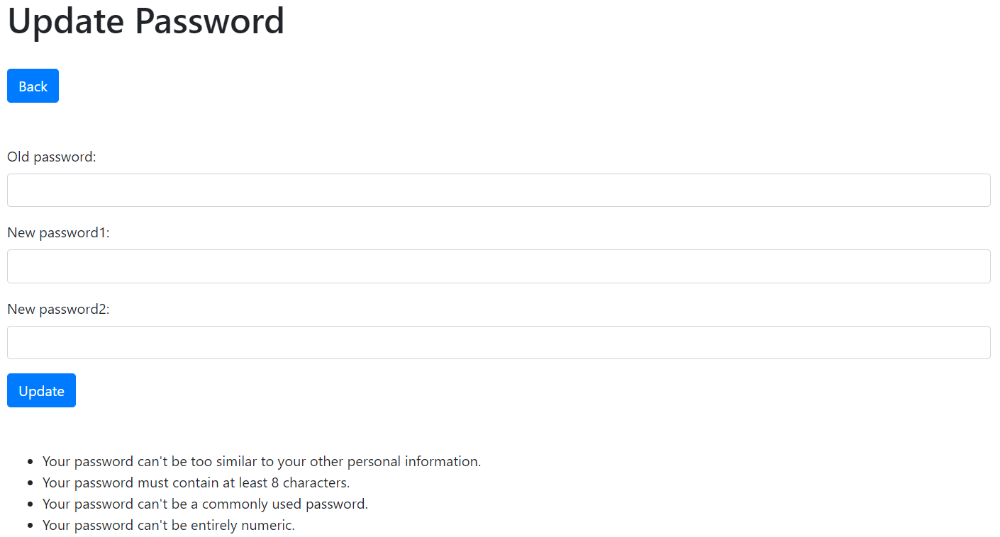

# I Love This Game

[View the live project here.](https://i-love-this-game.herokuapp.com/)

This is a blog dedicated to old-school/retro/vintage NBA (National Basketball Association), specifically about the 80s/90s era, the best years in the history of American basketball. It's a space of discussion where opinions and information can be shared in a healthy way, but it's mostly meant to be a nostalgic and beautiful trip down memory lane and a celebration of this sport. It’s designed to be a simple-to-use and functional app, and also responsive and accessible on a range of devices, making it easy to navigate for NBA fans.

## User Experience (UX)

### • User Stories

#### As a user, I can:

o click on the social media links in the footer so that I can follow the blog's presence on social media and interact with the NBA community and the blog's administrators

o access a page on the blog where I can create a post so that I can write my posts

o update my blog posts so that I'm in control of my posts only

o delete my posts so that I can decide if I want to keep my posts on the blog or not

o see the blog's posts ordered by date so that I can see the most recent ones first

o register on the blog so that I can log in every time I want to post something

o look for posts by category so that I can easily access any specific posts I may look for

o access a page where I can add a new category for my posts so that it's easier for the other users to find them

o don't want any other users to be able to edit my posts, and I shouldn't be able to edit other users' posts either

o log in so that I can create posts of my own

o click on any post's like button so that I can like posts

o click on any post's unlike button so that I can unlike posts

o use my first name or may last name or may email address so that I can register

o style the text of my posts so that I can make them more appealing to read

o look at the snippet of any post so that I know what it's about without having to click on it to read it

o use the edit profile page so that I can create my profile

o use the checkboxes on the profile page so that I can easily create my profile

o access a password page on the blog so that I can change my password without having to use the admin page

o upload a header image for any post of mine so that my posts are easy to identify

o add a profile picture and social media links to my profile so that I make it more complete and this information is visible to any users who read each of my posts

o add a profile picture so that it's visible on each of my posts

o create my profile on my own profile page so that the info is visible on my posts

o access an edit profile page so that I can edit my profile

o access and complete a form on the blog so that I can create and edit my profile

o see all the comments on any post so that I can read them

o fill out a comment form so that I can comment on any posts

o complete an easy-to-use form to log in so that I can use the blog as a logged-in user

o check if my name is on the right-hand side of the navbar so that I know if I'm logged in or not

o submit a simple form so that I can send a private message to the administrator of the blog, who will see the message on the admin area

o click on the about link on the navbar so that I can access the about section of the blog and find out more about it and its developer

o perform any action I'm allowed to when using the blog and be informed each time so that I know that my actions were performed

o and though I'm a person with disabilities, I'm able use the blog's features so that I can access the blog as easily as users who do not have special needs do

#### As a developer, I can:

o set up the project and deploy it for the first time so that everything works before creating any code

o create a Django superuser for the admin area so that I have control of what is posted on the blog

o use Django class-based views to create webpages out of blog posts so that every post can be seen by the user on a page dedicated to that post

o use class-based generic views so that I can add site pagination

o use Bootstrap to create and style the blog so that it looks more appealing to the user

o use Bootstrap so that I can style the backend form

o create functionality that allows the users to look for posts by category so that the users can easily access any specific posts they may look for

o create slug URLs for the category pages so that every post has a unique URL

o add a bio field to the User model so that this option will be available to users

o add an image to the Home page so that the user can view it when accessing the page's content and have a better, more pleasant visual experience

o want to test all features of the blog so that any bugs are found and fixed before the final deployment

o want to create the blog's README.md file so that all details of its creation are documented

### • Design

#### o Color Scheme

This is a blog about the NBA, so it made sense to add the NBA colors (blue, red and white) to it, mainly using the logo image and the image on the Home page, so the users can immediately identify what the blog is about (the NBA's logo is known worldwide, even most people who are not into basketball will have seen it before). The dark color used on the navbar and the footer is from Bootstrap's "bg-dark" class (#343a40) and aims to emulate [the NBA's official website's navbar](docs/nba-official-website-navbar.png) and footer: a dark background color with white text and light grey text, which becomes lighter when hovered over by the user for better readability and accessibility. All content is written on a white background using black-colored text, the perfect contrast for any amount of text when it comes to readability and accessibility, also used by the NBA's official website. The links have the normal hyperlink blue color, which happens to match the blue NBA color, and the same applies to all the buttons on the body of the blog's pages created for users to action something (this blue color is from Bootstrap's "btn-primary" class).

Please see the results for the body's color contrast check [here](docs/color-contrast-check-body.png).
Please see the results for the navbar's and the footer's color contrast check [here](docs/color-contrast-check-navbar-and-footer-white-text.png) and [here](docs/color-contrast-check-navbar-and-footer-light-grey-text.png).

#### o Typography

Roboto is the font used in the NBA'S official website, it suits the layout and the style of this blog and provides clear reading and accessibility for the user, so it was used as part of a [system font stack already available on the user's machine](docs/system-font-stack.png), which is believed to be a useful and elegant solution that eliminates the need to fetch a font elsewhere and makes load times faster (fonts are usually one of the heaviest resources loaded on any app). It matches what the current Operating System uses, so it lends a comfortable look to this project. It was imported along with the Bootstrap code used throughout the blog.

#### o Imagery

Very much on purpose, there are not many images on this blog. The two images used - [the one on the Home page](theblog/static/images/home-image.png) and [the one on the navbar's logo](theblog/static/images/logo.png) - do much of the work helping the user identifying what this project is about and providing color/style to the first page the user sees when he/she lands on the blog (the colors of the NBA - blue, red and white - are crucial here). Users can upload a photo to their profile, and they can upload an image to every single post they create, so many images decorating this blog's articles are to be expected in the future (Cloudinary is the image-hosting service used to upload images for this project). There's also a [no-profile-icon image](theblog/static/images/no-profile-photo-icon.png), which is added as a photo to profiles where the user hasn't uploaded his/her/a photo. And, of course, there's [the favicon image](theblog/static/images/favicon-basketball.png) used for this blog (very appropriately, a basketball).

### • Wireframes

o Desktop wireframe (Home 1 - user logged out page) - [View](docs/wireframes/home-1-user-logged-out-page-desktop.png)

o Desktop wireframe (Home 2 - user logged out page) - [View](docs/wireframes/home-2-user-logged-out-page-desktop.png)

o Desktop wireframe (About page) - [View](docs/wireframes/about-page-desktop.png)

o Desktop wireframe (Categories page) - [View](docs/wireframes/categories-page-desktop.png)

o Desktop wireframe (Register page) - [View](docs/wireframes/register-page-desktop.png)

o Desktop wireframe (Log in page) - [View](docs/wireframes/log-in-page-desktop.png)

o Desktop wireframe (Home 1 - user logged in page) - [View](docs/wireframes/home-1-user-logged-in-page-desktop.png)

o Desktop wireframe (Home 2 - user logged in page) - [View](docs/wireframes/home-2-user-logged-in-page-desktop.png)

o Desktop wireframe (Create Article page) - [View](docs/wireframes/create-article-page-desktop.png)

o Desktop wireframe (Article page) - [View](docs/wireframes/article-page-desktop.png)

o Desktop wireframe (Update Article page) - [View](docs/wireframes/update-article-page-desktop.png)

o Desktop wireframe (Delete Article page) - [View](docs/wireframes/delete-article-page-desktop.png)

o Desktop wireframe (Create Comment page) - [View](docs/wireframes/create-comment-page-desktop.png)

o Desktop wireframe (Create Category page) - [View](docs/wireframes/create-category-page-desktop.png)

o Desktop wireframe (Contact page) - [View](docs/wireframes/contact-page-desktop.png)

o Desktop wireframe (Update Settings page) - [View](docs/wireframes/update-settings-page-desktop.png)

o Desktop wireframe (Update Password page) - [View](docs/wireframes/update-password-page-desktop.png)

o Desktop wireframe (Create Profile page) - [View](docs/wireframes/create-profile-page-desktop.png)

o Desktop wireframe (Show Profile page) - [View](docs/wireframes/show-profile-page-desktop.png)

o Desktop wireframe (Update Profile page) - [View](docs/wireframes/update-profile-page-desktop.png)

o Mobile wireframe (Home - user logged out page) - [View](docs/wireframes/home-user-logged-out-page-mobile.png)

o Mobile wireframe (About page) - [View](docs/wireframes/about-page-mobile.png)

o Mobile wireframe (Categories page) - [View](docs/wireframes/categories-page-mobile.png)

o Mobile wireframe (Register page) - [View](docs/wireframes/register-page-mobile.png)

o Mobile wireframe (Log in page) - [View](docs/wireframes/log-in-page-mobile.png)

o Mobile wireframe (Home - user logged in page) - [View](docs/wireframes/home-user-logged-in-page-mobile.png)

o Mobile wireframe (Create Article page) - [View](docs/wireframes/create-article-page-mobile.png)

o Mobile wireframe (Article page) - [View](docs/wireframes/article-page-mobile.png)

o Mobile wireframe (Update Article page) - [View](docs/wireframes/update-article-page-mobile.png)

o Mobile wireframe (Delete Article page) - [View](docs/wireframes/delete-article-page-mobile.png)

o Mobile wireframe (Create Comment page) - [View](docs/wireframes/create-comment-page-mobile.png)

o Mobile wireframe (Create Category page) - [View](docs/wireframes/create-category-page-mobile.png)

o Mobile wireframe (Contact page) - [View](docs/wireframes/contact-page-mobile.png)

o Mobile wireframe (Update Settings page) - [View](docs/wireframes/update-settings-page-mobile.png)

o Mobile wireframe (Update Password page) - [View](docs/wireframes/update-password-page-mobile.png)

o Mobile wireframe (Create Profile page) - [View](docs/wireframes/create-profile-page-mobile.png)

o Mobile wireframe (Show Profile page) - [View](docs/wireframes/show-profile-page-mobile.png)

o Mobile wireframe (Update Profile page) - [View](docs/wireframes/update-profile-page-mobile.png)

### • Data Model

The data model for this project was built using Excel. A screenshot of the spreadsheet was then converted into an image file and has been made available on this README.md file. It makes extensive use of Django's built-in User model.

Five models were created for this project. Being a blog, the Post model (with all the necessary fields for the blog's posts, linked to the Category and User models through ForeignKeys and, again, to the User model through a ManyToManyField relationship, as a post can have many likes by many users) and the Comment model (with all the necessary fields for all posts' comments, linked to the Post and User models through ForeignKeys) were obvious choices, but there are also the Category model (with all the necessary fields for the blog's posts's categories - the Post model is linked to it through a ForeignKey) and the Profile model (with all the necessary fields for the users' profiles, linked to the User model through a OneToOneField relationship, as a user has only one profile - this model and all of its functionality is kept in a separate app specifically created for this purpose, the "members" app, for a better understanding of the blog's code and its many functionalities, as all other models are kept in the "theblog" app) - these four models were created based on John Elder's video tutorial on how to create a blog with Python and Django on YouTube (it can be found [here](https://www.youtube.com/watch?v=B40bteAMM_M)) and tweaked in order to meet the needs of this project and the ideas of its creator. The fifth model is an original idea by the creator of this blog, as some sort of direct/private contact between the blog's logged-in users and the site administrator was necessary - it's also kept in the "theblog" app.

Object-Oriented Programming and Django’s class-based views were widely used throughout this project but, in a few specific blocks of code, function-based views were also used.

### • Agile Project Planning

This project was planned and carried out using an Agile approach. 45 User Stories were created based on the idea of building a basketball blog by the creator of this project, and the planning of each step in the Agile plan of action used was done based on John Elder's video tutorial on how to create a blog with Python and Django on YouTube (it can be found [here](https://www.youtube.com/watch?v=B40bteAMM_M)) - it greatly helped organizing the thinking and prioritization of the User Stories and tasks that let to the final product that is I Love This Game.

Each User Story was created on GitHub using a User Story template created for this purpose (each step of this Agile plan was created on GitHub, for that matter). The User Stories were then transferred to a Product Backlog, created using the "Milestones" tab, and refined/re-prioritized as needed.

The MoSCoW technique (MUST-have, SHOULD-have, COULD-have, WON'T-have) was then used to add one of these specific labels to each of the User Stories based on the User Story's importance to the project - these labels were also created using the "Milestones" tab.

Then, a Project called "I Love This Game Blog User Stories" was created and, inside it, a Kanban Board, where all the User Stories were again transferred to. This simple Kanban Board has three columns - "Todo", "In Progress" and "Done" - and the User Stories would go from the "Todo" column to the "In Progress" column when they were being worked on. This was a huge help when tracking progress of what had been done and what still needed to be done throughout the project. When the User Story's tasks were performed and the User Story functionality was implemented, it would be finally moved to the "Done" column. This was basically how this project was planned and built. The Kanban Board for this project can be found [here](https://github.com/users/PedroMiguelFerreira/projects/4/views/1) - only one COULD-have User Story was not implemented on this iteration, but it might be in the future.

## Features

• Favicon

o The favicon for this blog - very appropriately, a basketball - is visible on browser tabs to help users identifying and the blog.

• Navigation Bar

o Built using Bootstrap and featured at the top of every page on this blog, this fully responsive navigation bar introduces the user to all the specific content on the app - when the user is not logged in, it shows links to the About page, a Categories dropdown menu with links to all the post categories, the Register page and the Log in page. When the user is logged in, it shows links to the About page, a Categories dropdown menu with links to all the post categories, the Create Article page, the Create Category page, the Contact page and, at the far-right, the name of the logged-in user (meaning that the user is logged in), which shows a dropdown menu with links to the Update Settings page, the Update Profile page, the Show Profile page and a link for the user to log out - when the user has no profile created yet, the dropdown menu of the name of the logged in user shows the same links except for the Update Profile page and the Show Profile page, which are replaced with a link to the Create Profile page.

o It's a sticky navigation bar, so it follows the user's viewport as he/she scrolls up and down each page of the blog, allowing the user to easily navigate through the content across all devices without having to go back to the top of the page to access other sections of the website. There's a highlight effect to each link on the navbar while being hovered over.

o It also contains the blog's slogan, which brings the user to the Home page when clicked on, and an NBA image with its logo (non-clickable) for styling and to easily state what the blog is about.

**When the user is logged out:**

Navbar:

Categories dropdown menu:

**When the user is logged in:**

Navbar:

Categories dropdown menu:

User-logged-in dropdown menu (when the user previously created a profile):

User-logged-in dropdown menu (when the user hasn't previously created a profile):

• Footer

o Built using Bootstrap, the footer includes a "Copyright © 2022 Pedro Ferreira" notice – it’s shown on every page of the website (it's a sticky footer, so it follows the user's viewport as he/she scrolls up and down every page on this blog). 

o The social media icons on it (for YouTube, Instagram, Twitter and Facebook) lead the user to the official social media pages for the NBA (as the creator of this blog has chosen not to make his social media accounts public at this stage).

o There's a highlight effect to each social media icon on the navbar when hovered over.

o Any external links will open in a new tab to allow easy navigation for the user and avoiding the user to leave the website.

• Home page

o The Home page works as the landing page, and its the first thing the user sees on this blog. It has a beautiful image of a slightly transformed NBA logo (for copyright purposes) at the top, to make the user aware it's a basketball website, and the NBA colors lend a sports feeling to the whole thing.

o By scrolling down, the user will see the most recent posts created by the blog's users. A button was added at the bottom of the page to go to the next page of posts (with older posts) - there are five posts per page so it doesn't get too crowded and the pages breathe better. Every post's details are visible (title, author, category, date, etc.), and the user can click on the title to view the post and on the category name to see a list of other posts belonging to the same category. If the user is the author of any given post, that post will have links to update/delete the post.

• Article page

o Every post page has the title at the top, along with the author's name and the date it was posted. It can be accessed by any user, logged in or not. There's also a back button to the Home page (many pages on this blog have one for an easier user navigation) in case the user wants to leave the page with no further action.

o Any external links will open in a new tab to allow easy navigation for the user and avoiding the user to leave the website.

o There's a like button for logged-in users to like/unlike the post, and also the profile of the post's author, which can be accessed by any user.

o There's also a comments section at the bottom of the page, with all the comments for the post - if the user is logged in, it can create a comment for the post.

• Create Article page

o If the user is logged in, he/she can create a post. It's a simple form, with a few fields to easily create a post, like title, title tag, category, body, snippet and an image field, which is the only one that is not mandatory.

o Once created, the user sees a confirmation message and is redirected to the Home page where he/she'll be able to see his/her post as the most recent post.

• Update Article page

o If the user is logged in, he/she can update his/her own posts by clicking on the "Update" link on the post itself.

o Once updated, the user sees a confirmation message and is redirected to the page of the updated post.

• Delete Article page

o If the user is logged in, he/she can delete his/her own posts by clicking on the "Delete" link on the post itself.

o Before deletion is done, the user is asked to confirm if he/she really wish to delete the post (extra confirmation in case it's not what the user wants to do).

o Once updated, the user is redirected to the Home page where he/she'll be able to see that his/her post is no longer there.

• About page

o A page that can be accessed by any users, logged in or not. It's an introduction to the blog and a description of the basketball era it aims to represent. It also contains an "Acknowledgements" sub-section, where the creator of this blog has thanked Bill Simmons and John Elder for their work, parts of which have been used as a base for this project.

o Any external links will open in a new tab to allow easy navigation for the user and avoiding the user to leave the website.

• Categories page

o A page that can be accessed by any users, logged in or not. The link on the navbar will show a dropdown menu with a list of categories created by users on the blog itself and the blog administrator - the user can choose to view posts from any category and, by clicking on the desired category, he/she'll be taken to a page with the list of posts for that category.

o When there are no posts for a specific category, the user will be brought to a page saying that there are currently no posts for that category.

• Register page

o A page that can be accessed by users who are logged out and/or haven't registered yet (they need to register in order to be able to log in and use all the blog's features as logged-in users).

o Once the user registers (there's a back button in case he/she has second thoughts), he/she sees a confirmation message and will be redirected to the Log In page so the user can finally log in.

• Log In page

o This is the page where the user can log in and have access to all the blog's functionality - once the user logs in, his/her name wil show up at the far-right of the navbar.

• Create Category page

o If the user is logged in, he/she can create a new category by completing the simplest of forms.

o Once the category is created, the user sees a confirmation message and is redirected to the Home page.

• Contact page

o If the user is logged in, he/she can contact the blog administrator directly by completing and sending a simple form. The blog administrator will receive it and view it in the admin area. There's no functionality for the administrator to reply to these messages via the admin area at this stage (maybe in the future).

o Once the message is sent, the user sees a confirmation message and is redirected to the Home page.

• Update Settings page

o If the user is logged in, he/she can update the settings on their account/profile on this page. Here, the user can also access a link to change his/her password.

• Update Password page

o If the user is logged in, he/she can update his/her password using the link on their Update Settings page.

o Once the password is updated, the user sees a confirmation message AND is redirected to a password success page, with a button that will redirect the user to the Home page when clicked on - two kinds of user action confirmation to show two ways of informing the user of a successful action.

• Create Profile page

o If the user is logged in, but doesn't have a profile yet, he/she can create one on this page.

o The only mandatory field is the bio, the rest can be added to the profile or not by the user. Any fields not used will not show up on the user's profile (photo, social media accounts, etc.).

o Once the profile is created, the user sees a confirmation message and is redirected to the Home page.

• Update Profile page

o If the user is logged in and already has a profile, he/she can update it one on this page.

o Once the profile is updated, the user sees a confirmation message and is redirected to the Home page.

• Show Profile page

o If the user is logged in and already has a profile, he/she can view it on this page.

• Login Error pages

o Whenever the user makes a mistake logging in - for example, opens any link of the blog on a separate tab, logs out on that separate tab and comes back to the first page it opened (where he's technically still logged in) and tries to access any page there, he/she won't be able to and a login error page will be shown to the user.

• Admin area

o In the admin area (to which only the superuser/blog administrator has access), the administrator can control the content of the blog as well what its users do on it.

o The admin user has access to more functionality than regular users, which allows them to create, read, update and delete information such as users, categories, comments, profiles, messages, posts and profiles.

o As mentioned before, only the superuser/blog administrator can access the admin area, and he can do so by adding "/admin" to the URL of the Home page and signing in.

## Features Left to Implement

• A Media page, with YouTube iFrames of old NBA videos from the 80s and 90s. "NBA Action", "I Love This Game", etc.... It would be a great add to this blog.

• Functionality that allows the user to delete a category created by himself/herself (on this iteration, the user is only allowed to create a category, not delete it).

• Functionality that allows the blog administrator to reply to the contact messages sent via the frontend by registered users. A view showing all the received messages (which is only accessible by the blog administrator) would have to be shown (something like Gmail's inbox, with a card or something similar for each message showing the sender's name and subject). Then, clicking on a message would take us into a message detail view, where we would be able to see the full message body - there would also be a form on that page, where the blog administrator could type a reply into.

• Functionality that allows the user to update/add an image to his/her post and change the category when updating it (every other field can be updated).

• Reply to post comments in a thread, like in Facebook, for example.

## Technologies Used

### Languages Used

• [HTML5](https://en.wikipedia.org/wiki/HTML5)

• [CSS3](https://en.wikipedia.org/wiki/CSS)

• [JavaScript](https://en.wikipedia.org/wiki/JavaScript)

• [Python](https://en.wikipedia.org/wiki/Python_(programming_language))

### Frameworks, Libraries, Programs, Databases & Other Tools Used

• [Django](https://en.wikipedia.org/wiki/Django_(web_framework)): Python framework used to create the backend logic

• [Bootstrap 4.4.1](https://en.wikipedia.org/wiki/Bootstrap_(front-end_framework)): CSS framework used to create the frontend and for responsiveness on all devices

• [jQuery](https://en.wikipedia.org/wiki/JQuery): it came with Bootstrap, along with Popper and Bootstrap JS, to make, for example, the navbar responsive and allow for the dropdown menus to work

• [SQLite](https://en.wikipedia.org/wiki/SQLite): used as the database during development

• [PostgreSQL](https://en.wikipedia.org/wiki/PostgreSQL): used as the database on deployment

• [Font Awesome](https://fontawesome.com/): used on the footer to add social media icons for aesthetic and UX purposes

• [Git](https://git-scm.com/): used for version control by utilizing the Gitpod (the IDE used) terminal to commit to Git and push to GitHub

• [GitHub](https://github.com/): used to store the project's code after being pushed from Git

• Snipping tool: A snipping tool was used to create the logo and resizing/editing the photos/images for the blog

• [TinyPNG](https://tinypng.com/): used to compress all four photos/images on the blog

• [Balsamiq](https://balsamiq.com/): used to create the wireframes during the design process

• [WebAIM](https://webaim.org/resources/contrastchecker/): used as a contrast checker for the colors used on the blog

• [Heroku](https://www.heroku.com/): used to deploy the live project

• [Microsoft Excel](https://en.wikipedia.org/wiki/Microsoft_Excel): used to create the model diagram during the design process

• [Chrome DevTools](https://developer.chrome.com/docs/devtools/): used to debug the blog and test responsiveness

• [Cloudinary](https://en.wikipedia.org/wiki/Cloudinary): the image-hosting service used to upload the images of the blog

• [GitHub Projects](https://docs.github.com/en/issues/organizing-your-work-with-project-boards/tracking-work-with-project-boards): used for the Agile planning and tracking of the project

## Testing

The W3C Markup Validator Service, the W3C CSS Validator Service, the JSHint Static Code Analysis Tool for JavaScript and the PEP8 Online Checker were used to validate every page of this project to ensure there were no syntax errors.

• W3C Markup Validator (results)

 [about](docs/html-validator-results-about.png)

 [add_category](docs/html-validator-results-add-category.png)

 [add_comment](docs/html-validator-results-add-comment.png)

 [add_post](docs/html-validator-results-add-post.png)

 [categories](docs/html-validator-results-categories.png)

 [category_list](docs/html-validator-results-category-list.png)

 [change_password](docs/html-validator-results-change-password.png)

 [contact](docs/html-validator-results-contact.png)

 [create_user_profile_page](docs/html-validator-results-create-user-profile-page.png)

 [delete_post](docs/html-validator-results-delete-post.png)

 [edit_profile_page](docs/html-validator-results-edit-profile-page.png)

 [login](docs/html-validator-results-login.png)

 [password_success](docs/html-validator-results-password-success.png)

 [update_post](docs/html-validator-results-update-post.png)

 [user_profile](docs/html-validator-results-user-profile.png)

 [edit_profile](docs/html-validator-results-edit-profile.png)
 There are three errors on this page when validation is ran - this is because a UserChangeForm was imported from django.contrib.auth.forms and used to create the content of this page, so it's a Django backend thing and can't be changed.

 [register](docs/html-validator-results-register.png)
 There are four errors on this page when validation is ran - this is because a UserCreationForm was imported from django.contrib.auth.forms and used to create the content of this page, so it's a Django backend thing and can't be changed.

 [article_details](docs/html-validator-results-article-details.png)

 [base](docs/html-validator-results-base.png)

 [home](docs/html-validator-results-home.png)

• W3C CSS Validator - [Results](docs/css-validator-results.png)

• JSHint - [Results](docs/javascript-validator-results.png)

• PEP8 Online Checker - [Results]()

The Am I Responsive? website design tester was used to test the responsiveness of this website. [Screenshot here](docs/am-i-responsive.png)

Google Chrome's DevTools were used to thoroughly test this website, including the Lighthouse tool - please see below screenshots of both Lighthouse reports (one for Desktop and one for Mobile).

The "83" in "Best Practices" for both Desktop and Mobile is due to, according to Lighthouse, the images being displayed with the incorrect ratio (it has to do with the dimensions of the images) and a low resolution (it has to do with the images' natural dimensions and the size they're being displayed), and the logo image is the image referenced on the report, but it's supposed to be this size (it was resized to be displayed exactly like this, though the report says the width and the height haven't been set, but they have), and it was compressed (all images have) to decrease page load time, as it should be. Also according to Lighthouse, another reason for the "83" in "Best Practices" for both Desktop and Mobile is the frontend JavaScript libraries with known security vulnerabilities - jQuery was referenced as the issue, but this library is necessary for, for example, the dropdown menus in the navbar, so it has to be on the code.

The "71" in "Performance" for mobile is due to, according to Lighthouse, the image elements not having explicit width and height, but they do; the image format used for the Home and Logo images (as well any other images) was PNG, and Lighthouse mentions that formats like WebP and AVIF often provide better compression than PNG, which would mean faster downloads and less data consumption but, on this occasion, it was decided that all images should be in PNG format, as compression is lossless, meaning that there's no loss in quality each time a file is opened and saved again, and PNG is also good for detailed/high-contrast images. The issue with properly sized images, incorrect ratio and low resolution (for the Home and Logo images again) is also mentioned on the report for Mobile, and was explained in the above paragraph for "Best Practices" already. Another reason for this low score on Mobile is, according to Lighthouse, the use of Bootstrap for JS and CSS, but these are necessary to make the blog work properly, so they have to be part of the code. The same is mentioned on the report for Mobile in relation to the Font Awesome Kit used on the code but, again, it needs to be there.

[Desktop](docs/lighthouse-report-desktop.png)

[Mobile](docs/lighthouse-report-mobile.png)
